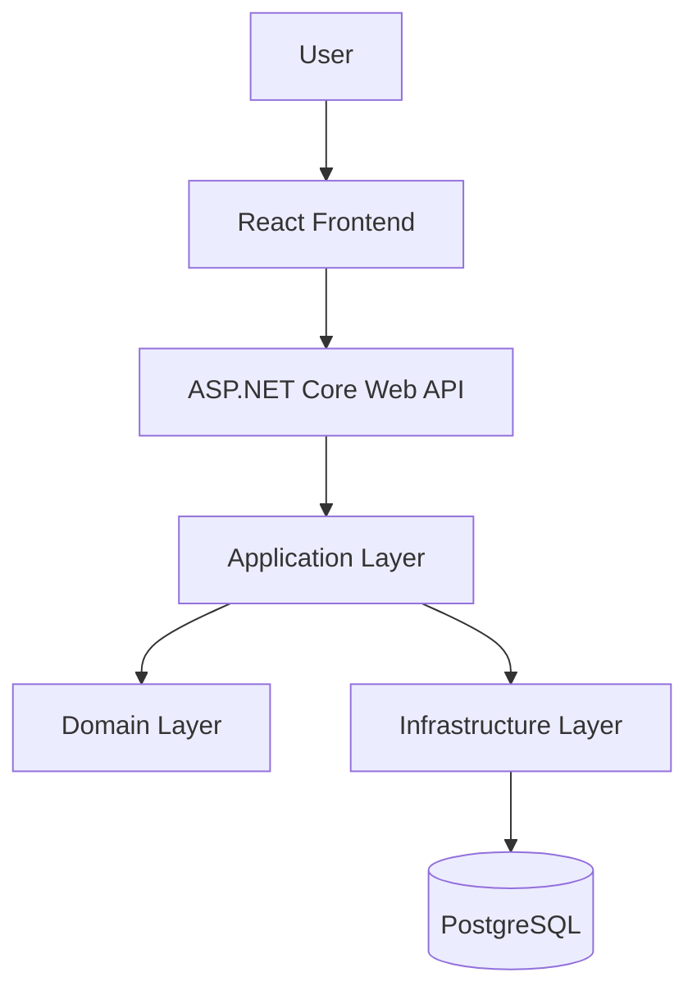
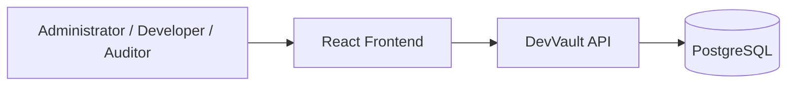
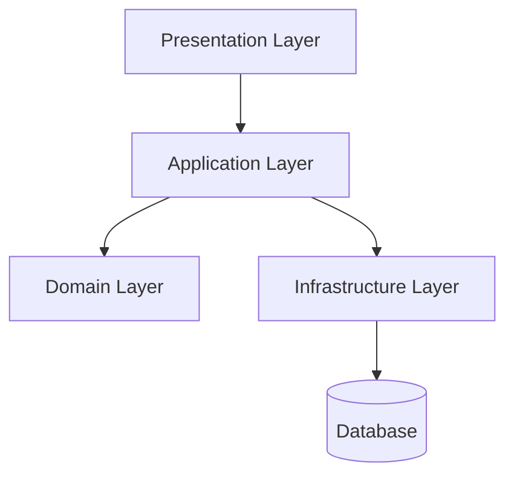
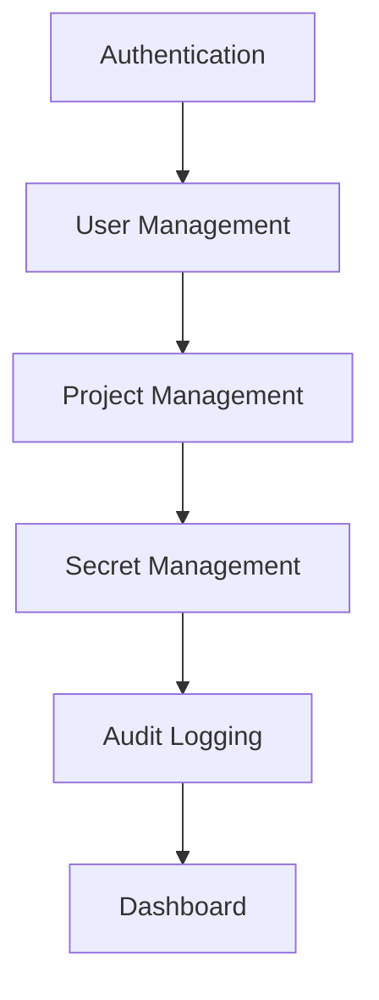
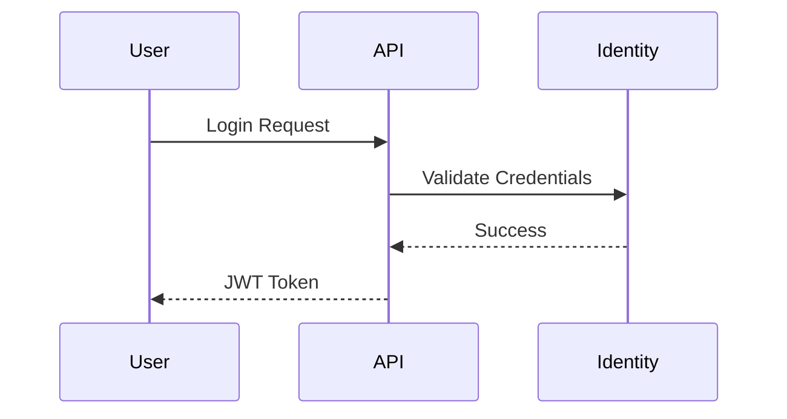
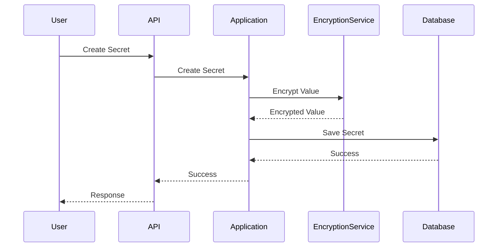
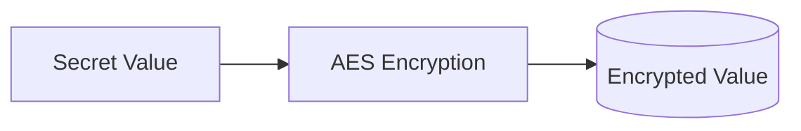
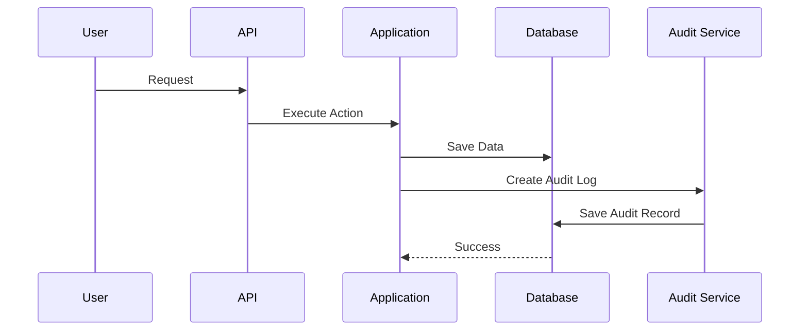
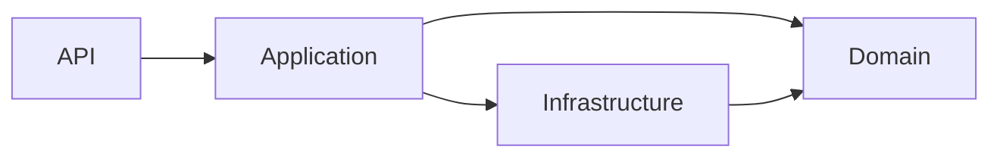

# Architecture Document

# DevVault

Version: 1.0

---

# Purpose

This document describes the architectural design of DevVault.

The architecture defines:

* System structure
* Architectural patterns
* Layer responsibilities
* Technology stack
* Security design
* Module interactions

The goal is to ensure the system remains maintainable, scalable, secure, and testable.

---

# Architectural Goals

The architecture must support:

* Security First Design
* Separation of Concerns
* Maintainability
* Testability
* Scalability
* Extensibility

---

# Architectural Style

DevVault follows:

## Clean Architecture

Clean Architecture separates business logic from external dependencies.

Benefits:

* Easier testing
* Lower coupling
* Better maintainability
* Infrastructure independence

---

## Modular Monolith

DevVault will initially be implemented as a Modular Monolith.

Reason:

* Simpler deployment
* Easier development
* Suitable for MVP
* Supports future migration to microservices

---

# High-Level Architecture



---

# System Context Diagram



---

# Layered Architecture



---

# Layer Responsibilities

## Presentation Layer

### Project

```text
DevVault.API
```

### Responsibilities

* Controllers
* Middleware
* Authentication
* Authorization
* Request Validation
* API Documentation

### Technologies

* ASP.NET Core
* Swagger
* JWT Authentication

---

## Application Layer

### Project

```text
DevVault.Application
```

### Responsibilities

* Use Cases
* Business Workflows
* Commands
* Queries
* DTOs
* Interfaces

### Examples

```text
CreateSecretCommand

GetSecretQuery

AssignUserToProjectCommand
```

The Application Layer coordinates business operations.

---

## Domain Layer

### Project

```text
DevVault.Domain
```

### Responsibilities

* Entities
* Value Objects
* Domain Rules
* Enumerations

### Examples

```text
User

Project

Secret

AuditLog
```

The Domain Layer contains business concepts only.

It must not depend on:

* Entity Framework
* ASP.NET Core
* Databases
* External Services

---

## Infrastructure Layer

### Project

```text
DevVault.Infrastructure
```

### Responsibilities

* Database Access
* Entity Framework Core
* Encryption
* Identity
* Logging
* Repository Implementations

### Examples

```text
DevVaultDbContext

SecretRepository

AesEncryptionService
```

Infrastructure provides technical implementations required by the application.

---

# Solution Structure

```text
src

├── DevVault.API
│
├── DevVault.Application
│
├── DevVault.Domain
│
├── DevVault.Infrastructure
│
└── DevVault.Tests
```

---

# Module Architecture

The system is divided into business modules.



---

# Authentication Architecture

## Overview

Users authenticate using:

* ASP.NET Identity
* JWT Access Tokens

---

## Authentication Flow



---

# Authorization Architecture

DevVault uses:

## Role-Based Authorization

Roles:

* Administrator
* Developer
* Auditor

---

## Policy-Based Authorization

Example Policies:

```text
CanManageUsers

CanManageProjects

CanManageSecrets

CanViewAuditLogs
```

Example:

```csharp
[Authorize(Policy = "CanManageSecrets")]
```

---

# Secret Storage Architecture

## Security Principle

Secrets must never be stored in plaintext.

---

## Secret Creation Flow



---

# Encryption Architecture

## Algorithm

AES-256 Encryption

---

## Process



---

# Audit Logging Architecture

All critical actions must generate audit records.

Examples:

* Login
* Failed Login
* Create Secret
* Update Secret
* Delete Secret
* View Secret
* Assign User

---

## Audit Flow



---

# Database Architecture

Database Technology:

```text
PostgreSQL
```

Core Tables:

```text
AspNetUsers
AspNetRoles
AspNetUserRoles

Projects
ProjectMembers

Secrets

AuditLogs
```

---

# Dependency Rules



Rules:

* API may depend on Application.
* Application may depend on Domain.
* Infrastructure may depend on Domain.
* Domain must not depend on any layer.

---

# Error Handling Strategy

Global exception handling will be implemented using middleware.

Responsibilities:

* Catch unhandled exceptions
* Log errors
* Return standardized responses

Example Response:

```json
{
  "success": false,
  "message": "Unexpected error occurred."
}
```

---

# Logging Strategy

Application logging levels:

```text
Information

Warning

Error

Critical
```

Logs should include:

* Timestamp
* User Identifier
* Request Path
* Error Details

---

# Testing Strategy

## Unit Tests

Test:

* Services
* Domain Logic
* Authorization Rules
* Encryption Logic

---

## Integration Tests

Test:

* Controllers
* Database Access
* Authentication Flows

---

# Security Considerations

## Authentication

* JWT Tokens
* ASP.NET Identity

## Authorization

* Role-Based Access Control
* Policy-Based Authorization

## Data Protection

* AES Encryption
* Password Hashing

## Auditability

* Complete Activity Logging

## Transport Security

* HTTPS in Production

---

# Future Architecture Evolution

Future versions may include:

* Multi-Tenant Support
* Secret Versioning
* MFA
* SSO
* API Key Authentication
* Background Jobs
* Notification Service

Potential migration path:

```text
Modular Monolith
        ↓
Service-Oriented Architecture
        ↓
Microservices (if required)
```

---

# Summary

DevVault adopts a Clean Architecture approach implemented as a Modular Monolith.

The architecture prioritizes:

* Security
* Maintainability
* Scalability
* Testability

The system is composed of four primary layers:

* Presentation Layer
* Application Layer
* Domain Layer
* Infrastructure Layer

This architecture serves as the foundation for implementation, testing, deployment, and future expansion of the DevVault platform.
