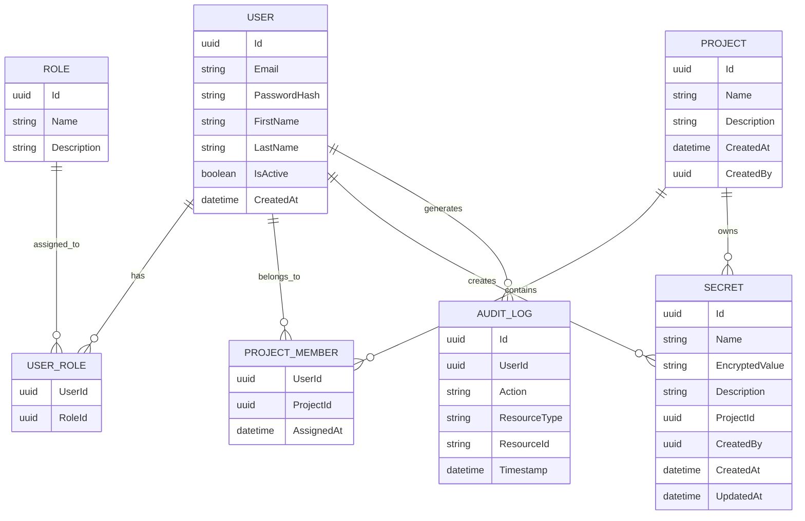

# Entity Relationship Diagram (ERD)

# DevVault

Version: 1.0

---

# Purpose

This document defines the data model for DevVault.

The Entity Relationship Diagram (ERD) describes:

* Core business entities
* Entity attributes
* Relationships between entities
* Cardinality rules
* Database design foundations

The ERD serves as the blueprint for:

* Domain Models
* Entity Framework Core Entities
* Database Tables
* Repository Design
* API Development

---

# Design Principles

The database design follows these principles:

* Normalized structure
* Separation of concerns
* Referential integrity
* Scalability
* Auditability
* Security-first design

Secrets are never stored in plaintext.

---

# Core Entities

The MVP consists of the following entities:

1. User
2. Role
3. UserRole
4. Project
5. ProjectMember
6. Secret
7. AuditLog

---

# Entity Relationship Diagram



---

# Entity Definitions

## User

Represents a person who can access the platform.

### Description

Users authenticate and interact with DevVault according to assigned roles and permissions.

### Attributes

| Field        | Type     | Description           |
| ------------ | -------- | --------------------- |
| Id           | UUID     | Unique identifier     |
| Email        | String   | Login email           |
| PasswordHash | String   | Hashed password       |
| FirstName    | String   | User first name       |
| LastName     | String   | User last name        |
| IsActive     | Boolean  | Account status        |
| CreatedAt    | DateTime | Account creation date |

---

## Role

Represents a permission group.

### Description

Roles determine what actions a user may perform.

### Initial Roles

* Administrator
* Developer
* Auditor

### Attributes

| Field       | Type   |
| ----------- | ------ |
| Id          | UUID   |
| Name        | String |
| Description | String |

---

## UserRole

Many-to-many bridge table between Users and Roles.

### Purpose

Allows a user to belong to one or more roles.

### Attributes

| Field  | Type |
| ------ | ---- |
| UserId | UUID |
| RoleId | UUID |

---

## Project

Logical container for secrets.

### Description

Projects organize secrets by application, service, or team.

### Examples

* Ecommerce API
* HR System
* Mobile Backend

### Attributes

| Field       | Type     |
| ----------- | -------- |
| Id          | UUID     |
| Name        | String   |
| Description | String   |
| CreatedAt   | DateTime |
| CreatedBy   | UUID     |

---

## ProjectMember

Many-to-many relationship between Users and Projects.

### Purpose

Controls project access.

### Attributes

| Field      | Type     |
| ---------- | -------- |
| UserId     | UUID     |
| ProjectId  | UUID     |
| AssignedAt | DateTime |

---

## Secret

Stores encrypted confidential values.

### Description

A secret belongs to a project and may represent:

* API Key
* Database Password
* JWT Secret
* SMTP Credential

### Security Rule

The actual value must be encrypted before storage.

### Attributes

| Field          | Type     |
| -------------- | -------- |
| Id             | UUID     |
| Name           | String   |
| EncryptedValue | String   |
| Description    | String   |
| ProjectId      | UUID     |
| CreatedBy      | UUID     |
| CreatedAt      | DateTime |
| UpdatedAt      | DateTime |

---

## AuditLog

Stores system activity history.

### Description

Provides accountability and traceability for sensitive operations.

### Examples

* User Login
* Secret Viewed
* Secret Created
* Secret Updated
* User Assigned To Project

### Attributes

| Field        | Type     |
| ------------ | -------- |
| Id           | UUID     |
| UserId       | UUID     |
| Action       | String   |
| ResourceType | String   |
| ResourceId   | String   |
| Timestamp    | DateTime |

---

# Relationship Rules

## User ↔ Role

Relationship:

```text
Many-to-Many
```

Reason:

A user may have multiple roles.

Examples:

* Admin + Auditor
* Developer + Auditor

---

## User ↔ Project

Relationship:

```text
Many-to-Many
```

Reason:

Users may participate in multiple projects.

Projects may contain multiple users.

---

## Project ↔ Secret

Relationship:

```text
One-to-Many
```

Reason:

A project contains many secrets.

A secret belongs to exactly one project.

---

## User ↔ Secret

Relationship:

```text
One-to-Many
```

Reason:

A user may create multiple secrets.

Each secret has one creator.

---

## User ↔ AuditLog

Relationship:

```text
One-to-Many
```

Reason:

A user generates many audit events.

Each audit event belongs to one user.

---

# Initial Database Tables

The MVP database should contain:

```text
AspNetUsers
AspNetRoles
AspNetUserRoles

Projects
ProjectMembers

Secrets

AuditLogs
```

ASP.NET Identity will manage:

* Users
* Roles
* UserRoles

Custom tables:

* Projects
* ProjectMembers
* Secrets
* AuditLogs

---

# Future Enhancements

Future versions may introduce:

## SecretVersion

Tracks historical secret values.

```text
Secret
   |
   +---- SecretVersion
```

---

## Invitation

Supports invitation-based onboarding.

```text
Admin
   |
   +---- Invitation
```

---

## Notification

Stores security alerts and reminders.

```text
User
   |
   +---- Notification
```

---

# Summary

The MVP data model consists of seven core entities:

* User
* Role
* UserRole
* Project
* ProjectMember
* Secret
* AuditLog

These entities support all MVP business requirements including:

* Authentication
* Authorization
* User Management
* Project Management
* Secret Management
* Audit Logging

This ERD forms the foundation for the Domain Layer, Entity Framework Core mappings, database migrations, and API implementation.
