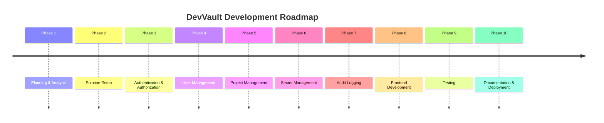

# Roadmap

# DevVault

Version: 1.0

---

# Purpose

This roadmap defines the planned development phases of DevVault.

The objective is to provide a structured implementation plan that guides development from project setup to a production-ready MVP.

The roadmap follows an incremental delivery approach where each milestone builds upon the previous one.

---

# Project Vision

DevVault aims to become a secure secret management platform that allows teams to:

* Store secrets securely
* Control access through roles and permissions
* Track system activities through audit logs
* Centralize secret management

---

# Development Strategy

Development will follow the following principles:

* Build from core to advanced features
* Deliver working software at every milestone
* Prioritize security and architecture first
* Avoid premature optimization
* Keep MVP scope manageable

---

# Project Milestones



---

# Phase 1 — Planning & Analysis

## Objective

Define project scope and architecture.

## Deliverables

* Vision.md
* Requirements.md
* UseCases.md
* ERD.md
* Architecture.md
* Roadmap.md

## Completion Criteria

* Business requirements approved
* Data model finalized
* Architecture finalized

Status:

```text
Current Phase
```

---

# Phase 2 — Solution Setup

## Objective

Create the foundational project structure.

## Deliverables

### Backend

```text
DevVault.API

DevVault.Application

DevVault.Domain

DevVault.Infrastructure

DevVault.Tests
```

### Frontend

```text
React

TypeScript

Tailwind CSS

Vite
```

### Infrastructure

```text
PostgreSQL

Git Repository

Docker Configuration
```

---

## Completion Criteria

* Solution compiles successfully
* Database connection established
* Frontend runs successfully

---

# Phase 3 — Authentication & Authorization

## Objective

Implement secure user authentication and access control.

## Features

### Authentication

* Login
* Logout
* JWT Token Generation
* Password Hashing

### Authorization

* Role-Based Authorization
* Policy-Based Authorization

### Roles

* Administrator
* Developer
* Auditor

---

## Deliverables

### Backend

```text
AuthController

JwtService

Identity Configuration

Authorization Policies
```

### Frontend

```text
Login Page

Protected Routes

Authentication Context
```

---

## Completion Criteria

* User can authenticate
* Protected endpoints require authorization
* JWT tokens function correctly

---

# Phase 4 — User Management

## Objective

Allow administrators to manage platform users.

## Features

* Create User
* Update User
* Deactivate User
* Assign Roles

---

## Deliverables

### Backend

```text
UsersController

UserService
```

### Frontend

```text
User List Page

Create User Form

Role Assignment UI
```

---

## Completion Criteria

* Admin can manage users
* Role assignments function correctly

---

# Phase 5 — Project Management

## Objective

Create organizational containers for secrets.

## Features

* Create Project
* Update Project
* Archive Project
* Assign Members

---

## Deliverables

### Backend

```text
ProjectsController

ProjectService
```

### Frontend

```text
Project List

Project Details

Member Assignment
```

---

## Completion Criteria

* Projects can be managed
* Users can be assigned to projects

---

# Phase 6 — Secret Management

## Objective

Implement secure secret storage.

## Features

* Create Secret
* View Secret
* Update Secret
* Delete Secret

### Security

* AES Encryption
* Permission Validation

---

## Deliverables

### Backend

```text
SecretsController

SecretService

EncryptionService
```

### Frontend

```text
Secret List

Secret Details

Create Secret Form
```

---

## Completion Criteria

* Secrets stored encrypted
* Authorized users can access secrets
* Unauthorized users are denied

---

# Phase 7 — Audit Logging

## Objective

Provide accountability and traceability.

## Features

* Login Logs
* Secret Access Logs
* User Activity Logs
* Administrative Activity Logs

---

## Deliverables

### Backend

```text
AuditService

AuditLogRepository
```

### Frontend

```text
Audit Log Viewer

Search Filters
```

---

## Completion Criteria

* Critical actions recorded
* Logs searchable

---

# Phase 8 — Frontend Development

## Objective

Deliver a complete user experience.

## Pages

### Authentication

* Login

### Dashboard

* Statistics
* Recent Activities

### Users

* User Management

### Projects

* Project Management

### Secrets

* Secret Management

### Audit Logs

* Audit Viewer

---

## Completion Criteria

* All backend functionality accessible through UI

---

# Phase 9 — Testing

## Objective

Ensure system quality and reliability.

## Unit Testing

### Services

* SecretService
* UserService
* ProjectService
* EncryptionService

---

## Integration Testing

### API Endpoints

* Authentication
* Users
* Projects
* Secrets

---

## Completion Criteria

* Core business logic tested
* Critical endpoints validated

---

# Phase 10 — Documentation & Deployment

## Objective

Prepare project for portfolio presentation.

## Documentation

* README.md
* Setup Guide
* Architecture Diagram
* API Documentation

---

## Deployment

### Backend

```text
ASP.NET Core API
```

### Frontend

```text
React Application
```

### Database

```text
PostgreSQL
```

---

## Completion Criteria

* Application deployed
* Documentation complete
* Portfolio ready

---

# MVP Scope

The MVP includes:

✅ Authentication

✅ Authorization

✅ User Management

✅ Project Management

✅ Secret Management

✅ Audit Logging

✅ Dashboard

---

# Post-MVP Features

The following features are intentionally postponed:

## Secret Versioning

Track historical secret changes.

---

## Invitations

Invite users through email.

---

## MFA

Multi-Factor Authentication.

---

## Secret Expiration

Automatic expiration monitoring.

---

## Notifications

Email and in-app notifications.

---

## API Access

Allow external systems to retrieve secrets.

---

# Future Releases

## Version 1.1

* Secret Versioning
* Secret Expiration
* Improved Dashboard

---

## Version 1.2

* Invitation System
* Email Notifications

---

## Version 2.0

* MFA
* API Access Tokens
* Secret Rotation

---

## Version 3.0

* Multi-Tenant Architecture
* SSO Integration
* Enterprise Features

---

# Definition of Done

A feature is considered complete when:

* Business requirements are implemented
* Security requirements are met
* Unit tests pass
* Integration tests pass
* Documentation is updated
* Code review is completed

---

# Success Criteria

The project is considered successful when:

* Secrets are encrypted at rest
* Access is controlled through roles
* Audit logs provide accountability
* The platform demonstrates enterprise software engineering practices
* The project serves as a production-quality portfolio piece

---

# Summary

DevVault will be developed through ten structured phases, progressing from planning and architecture to implementation, testing, and deployment.

The MVP focuses on secure secret management, authentication, authorization, and auditability while establishing a strong architectural foundation for future enterprise features.
