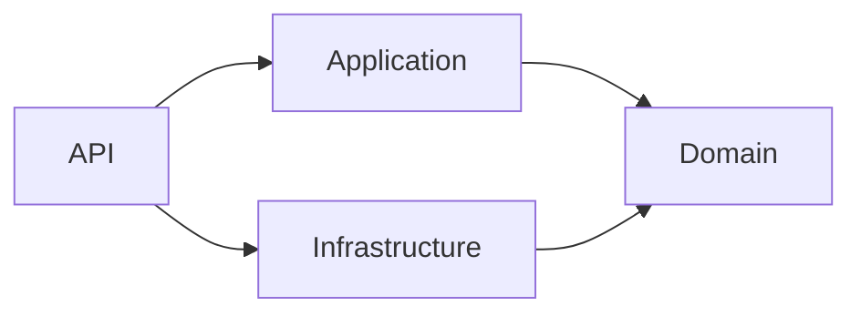

# Solution Structure

# DevVault

Version: 1.0

---

# Purpose

This document defines the physical repository structure and source code organization for DevVault.

The objectives are:

* Maintainability
* Scalability
* Separation of Concerns
* Clean Architecture compliance
* Team collaboration readiness
* Deployment readiness

The repository follows a Monorepo approach where backend and frontend applications are managed within a single repository.

---

# Repository Structure

```text
DevVault
│
├── docs
│
├── src
│   │
│   ├── backend
│   │
│   └── frontend
│
├── deployment
│
├── scripts
│
├── .github
│
├── docker-compose.yml
│
├── .gitignore
│
└── README.md
```

---

# Documentation Structure

```text
docs
│
├── Vision.md
├── Requirements.md
├── UseCases.md
├── ERD.md
├── Architecture.md
├── Roadmap.md
├── API-Spec.md
└── Solution-Structure.md
```

---

# Source Code Structure

```text
src
│
├── backend
│
└── frontend
```

---

# Backend Structure

The backend follows Clean Architecture principles.

```text
backend
│
├── DevVault.sln
│
├── src
│   │
│   ├── DevVault.API
│   ├── DevVault.Application
│   ├── DevVault.Domain
│   └── DevVault.Infrastructure
│
└── tests
    │
    ├── DevVault.UnitTests
    └── DevVault.IntegrationTests
```

---

# Backend Solution Overview

```text
DevVault.sln
│
├── DevVault.API
├── DevVault.Application
├── DevVault.Domain
├── DevVault.Infrastructure
├── DevVault.UnitTests
└── DevVault.IntegrationTests
```

---

# Backend Layer Responsibilities

## DevVault.API

### Layer

Presentation Layer

### Responsibilities

* Controllers
* Middleware
* Authentication
* Authorization
* Swagger
* Dependency Injection Registration
* API Configuration

### Structure

```text
DevVault.API
│
├── Controllers
├── Middleware
├── Extensions
├── Configurations
├── Filters
├── Models
├── Properties
├── appsettings.json
└── Program.cs
```

---

### Controllers

```text
Controllers
│
├── AuthController.cs
├── UsersController.cs
├── RolesController.cs
├── ProjectsController.cs
├── SecretsController.cs
├── AuditLogsController.cs
└── DashboardController.cs
```

---

### Middleware

```text
Middleware
│
├── ExceptionMiddleware.cs
├── RequestLoggingMiddleware.cs
└── SecurityHeadersMiddleware.cs
```

---

# DevVault.Application

### Layer

Application Layer

### Responsibilities

* Use Cases
* Commands
* Queries
* DTOs
* Validators
* Interfaces
* Business Workflows

### Structure

```text
DevVault.Application
│
├── Features
├── Common
├── Interfaces
├── DTOs
└── Behaviors
```

---

# Feature Organization

The application layer follows a feature-based structure.

```text
Features
│
├── Authentication
├── Users
├── Projects
├── Secrets
├── AuditLogs
└── Dashboard
```

---

## Example Feature Structure

```text
Features
│
└── Secrets
    │
    ├── Commands
    │   ├── CreateSecret
    │   ├── UpdateSecret
    │   └── DeleteSecret
    │
    ├── Queries
    │   ├── GetSecretById
    │   └── GetSecrets
    │
    ├── DTOs
    │
    └── Validators
```

---

# DevVault.Domain

### Layer

Domain Layer

### Responsibilities

* Entities
* Value Objects
* Domain Rules
* Enumerations
* Business Concepts

### Structure

```text
DevVault.Domain
│
├── Entities
├── Enums
├── ValueObjects
├── Constants
└── Events
```

---

## Entities

```text
Entities
│
├── Project.cs
├── ProjectMember.cs
├── Secret.cs
├── AuditLog.cs
└── SecretAccessLog.cs
```

---

## Notes

Users and Roles are managed by ASP.NET Identity and therefore are implemented in Infrastructure.

The Domain Layer should not depend on:

* ASP.NET Core
* Entity Framework Core
* Identity
* PostgreSQL
* External Services

---

# DevVault.Infrastructure

### Layer

Infrastructure Layer

### Responsibilities

* Database Access
* ASP.NET Identity
* Entity Framework Core
* Encryption
* Repositories
* Logging
* External Services

### Structure

```text
DevVault.Infrastructure
│
├── Persistence
├── Identity
├── Repositories
├── Security
├── Services
└── BackgroundJobs
```

---

# Persistence

```text
Persistence
│
├── DevVaultDbContext.cs
│
├── Configurations
│
├── Migrations
│
└── Seed
```

---

# Identity

```text
Identity
│
├── ApplicationUser.cs
├── ApplicationRole.cs
├── IdentitySeeder.cs
└── CustomClaimsPrincipalFactory.cs
```

---

# Security

```text
Security
│
├── JwtService.cs
├── AesEncryptionService.cs
├── PasswordPolicy.cs
└── TokenGenerator.cs
```

---

# Services

```text
Services
│
├── AuditService.cs
├── CurrentUserService.cs
├── DateTimeService.cs
└── EncryptionService.cs
```

---

# Backend Tests

## Unit Tests

```text
DevVault.UnitTests
│
├── Authentication
├── Users
├── Projects
├── Secrets
└── AuditLogs
```

Example:

```text
Secrets
│
├── CreateSecretTests.cs
├── UpdateSecretTests.cs
└── DeleteSecretTests.cs
```

---

## Integration Tests

```text
DevVault.IntegrationTests
│
├── Authentication
├── Users
├── Projects
├── Secrets
└── AuditLogs
```

Example:

```text
Authentication
│
└── LoginEndpointTests.cs
```

---

# Frontend Structure

The frontend is implemented using:

* React
* TypeScript
* Vite
* Tailwind CSS

---

## Frontend Root Structure

```text
frontend
│
├── public
│
├── src
│
├── package.json
│
├── vite.config.ts
│
└── tsconfig.json
```

---

# Frontend Source Structure

```text
src
│
├── app
├── assets
├── components
├── features
├── hooks
├── layouts
├── pages
├── routes
├── services
├── types
└── utils
```

---

# Frontend Feature Structure

```text
features
│
├── auth
├── users
├── projects
├── secrets
├── auditLogs
└── dashboard
```

Example:

```text
features
│
└── secrets
    │
    ├── api
    ├── components
    ├── hooks
    ├── pages
    └── types
```

---

# Deployment Structure

```text
deployment
│
├── docker
│
├── nginx
│
└── kubernetes
```

---

# Scripts Structure

```text
scripts
│
├── setup.sh
├── migrate.sh
├── seed.sh
└── backup.sh
```

---

# Dependency Rules



---

# Allowed Dependencies

| Project                 | Dependencies                |
| ----------------------- | --------------------------- |
| DevVault.API            | Application, Infrastructure |
| DevVault.Application    | Domain                      |
| DevVault.Infrastructure | Domain                      |
| DevVault.Domain         | None                        |

---

# Forbidden Dependencies

* Domain → Infrastructure
* Domain → API
* Domain → Entity Framework Core
* Domain → ASP.NET Core
* Application → API

---

# Naming Conventions

## Controllers

```text
AuthController
UsersController
ProjectsController
SecretsController
```

---

## Commands

```text
CreateUserCommand
CreateProjectCommand
CreateSecretCommand
```

---

## Queries

```text
GetUsersQuery
GetProjectsQuery
GetSecretsQuery
```

---

## DTOs

```text
CreateUserRequest
CreateUserResponse
```

---

# Definition of Done

A feature is complete when:

* Requirements implemented
* Validation implemented
* Authorization implemented
* Unit tests passing
* Integration tests passing
* API documentation updated
* Security review completed

---

# Summary

DevVault uses a Monorepo architecture with separate backend and frontend applications.

Backend development follows Clean Architecture and consists of:

* DevVault.API
* DevVault.Application
* DevVault.Domain
* DevVault.Infrastructure

Frontend development follows a feature-based React architecture.

This structure provides a solid foundation for maintainability, scalability, testing, deployment, and future enterprise-level enhancements.
