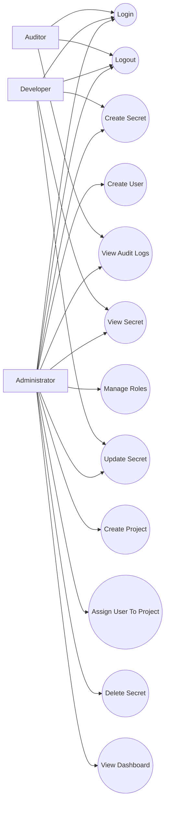

# Use Cases

# DevVault

Version: 1.0

---

# Document Purpose

This document describes how users interact with the DevVault system and defines the expected behavior of the platform from a business perspective.

Use cases serve as a bridge between business requirements and technical implementation by describing the actions performed by users and the system.

---

# Actors

## Administrator

Responsible for managing the platform.

Permissions:

* Manage Users
* Manage Roles
* Manage Projects
* Manage Secrets
* View Audit Logs
* View Dashboard

---

## Developer

Responsible for accessing and managing secrets within authorized projects.

Permissions:

* View Assigned Projects
* Create Secrets
* View Secrets
* Update Secrets

Restrictions:

* Cannot Manage Users
* Cannot Delete Projects
* Cannot Modify Roles

---

## Auditor

Responsible for reviewing system activities and security events.

Permissions:

* View Audit Logs
* Review Security Events

Restrictions:

* Cannot View Secret Values
* Cannot Modify Resources

---

# Use Case Diagram

---

# UC-001 Login

## Goal

Allow a registered user to authenticate and access the system.

## Primary Actor

User

## Preconditions

* User account exists.
* User account is active.

## Main Flow

1. User enters email and password.
2. System validates credentials.
3. System generates JWT token.
4. System records login activity.
5. System redirects user to dashboard.

## Alternative Flow

### Invalid Credentials

1. System rejects authentication.
2. System records failed login attempt.
3. System displays error message.

## Postconditions

* User is authenticated.
* JWT token is issued.

---

# UC-002 Logout

## Goal

Terminate an authenticated session.

## Primary Actor

User

## Preconditions

* User is authenticated.

## Main Flow

1. User selects Logout.
2. System invalidates session.
3. System records logout activity.
4. User is redirected to Login page.

## Postconditions

* Session is terminated.

---

# UC-003 Create User

## Goal

Allow administrators to create user accounts.

## Primary Actor

Administrator

## Preconditions

* Administrator is authenticated.

## Main Flow

1. Administrator navigates to User Management.
2. Administrator selects Create User.
3. Administrator enters user details.
4. Administrator assigns role.
5. System validates data.
6. System creates user account.
7. System records audit log.

## Postconditions

* User account exists.

---

# UC-004 Update User Role

## Goal

Allow administrators to assign or modify user roles.

## Primary Actor

Administrator

## Preconditions

* User exists.

## Main Flow

1. Administrator selects a user.
2. Administrator changes role.
3. System validates request.
4. System updates role assignment.
5. System records audit event.

## Postconditions

* User permissions are updated.

---

# UC-005 Create Project

## Goal

Create a project container for managing secrets.

## Primary Actor

Administrator

## Preconditions

* Administrator is authenticated.

## Main Flow

1. Administrator selects Create Project.
2. Administrator enters project information.
3. System validates project data.
4. System creates project.
5. System records audit event.

## Postconditions

* Project exists.

---

# UC-006 Assign User To Project

## Goal

Grant a user access to a project.

## Primary Actor

Administrator

## Preconditions

* User exists.
* Project exists.

## Main Flow

1. Administrator opens project details.
2. Administrator selects Assign User.
3. Administrator chooses a user.
4. System creates project membership.
5. System records audit log.

## Postconditions

* User gains project access.

---

# UC-007 Create Secret

## Goal

Store a sensitive value securely.

## Primary Actor

Administrator, Developer

## Preconditions

* User has project access.

## Main Flow

1. User opens project.
2. User selects Create Secret.
3. User enters secret name.
4. User enters secret value.
5. System validates request.
6. System encrypts secret.
7. System stores encrypted value.
8. System records audit event.
9. System returns success response.

## Alternative Flow

### Unauthorized Access

1. User lacks required permission.
2. Request is denied.
3. Security event is recorded.

## Postconditions

* Secret is stored securely.

---

# UC-008 View Secret

## Goal

Retrieve a stored secret value.

## Primary Actor

Administrator, Developer

## Preconditions

* Secret exists.
* User has permission.

## Main Flow

1. User selects a secret.
2. System verifies permissions.
3. System decrypts secret value.
4. System displays secret.
5. System records access activity.

## Alternative Flow

### Unauthorized Access

1. Permission validation fails.
2. Access is denied.
3. Security event is recorded.

## Postconditions

* Secret value is displayed.

---

# UC-009 Update Secret

## Goal

Modify an existing secret.

## Primary Actor

Administrator, Developer

## Preconditions

* Secret exists.
* User has permission.

## Main Flow

1. User selects Edit Secret.
2. User updates secret value.
3. System validates request.
4. System encrypts new value.
5. System updates database.
6. System records audit event.

## Postconditions

* Secret value is updated.

---

# UC-010 Delete Secret

## Goal

Remove a secret from the system.

## Primary Actor

Administrator

## Preconditions

* Secret exists.

## Main Flow

1. Administrator selects Delete Secret.
2. System requests confirmation.
3. Administrator confirms action.
4. System deletes secret.
5. System records audit event.

## Postconditions

* Secret no longer exists.

---

# UC-011 View Audit Logs

## Goal

Review system activities and security events.

## Primary Actor

Administrator, Auditor

## Preconditions

* User is authenticated.

## Main Flow

1. User opens Audit Logs page.
2. System retrieves audit records.
3. User applies filters.
4. System displays matching logs.

## Postconditions

* Audit history is displayed.

---

# UC-012 View Dashboard

## Goal

Provide operational visibility and system statistics.

## Primary Actor

Administrator

## Preconditions

* User is authenticated.

## Main Flow

1. User accesses Dashboard.
2. System retrieves metrics.
3. System displays:

   * Total Users
   * Total Projects
   * Total Secrets
   * Recent Activities
4. User reviews information.

## Postconditions

* Dashboard metrics are displayed.

---

# UC-013 Unauthorized Resource Access

## Goal

Protect sensitive resources from unauthorized users.

## Primary Actor

Any User

## Preconditions

* User attempts unauthorized operation.

## Main Flow

1. User sends request.
2. System evaluates permissions.
3. Permission validation fails.
4. System returns Access Denied response.
5. System records security event.

## Postconditions

* Resource remains protected.

---

# Use Case Traceability

| Use Case                      | Related Requirement |
| ----------------------------- | ------------------- |
| UC-001 Login                  | FR-001 – FR-006     |
| UC-002 Logout                 | FR-004              |
| UC-003 Create User            | FR-101 – FR-105     |
| UC-004 Update User Role       | FR-103              |
| UC-005 Create Project         | FR-201 – FR-205     |
| UC-006 Assign User To Project | FR-204              |
| UC-007 Create Secret          | FR-301 – FR-306     |
| UC-008 View Secret            | FR-302, FR-307      |
| UC-009 Update Secret          | FR-303              |
| UC-010 Delete Secret          | FR-304              |
| UC-011 View Audit Logs        | FR-501 – FR-510     |
| UC-012 View Dashboard         | FR-601 – FR-604     |
| UC-013 Unauthorized Access    | FR-401 – FR-404     |

---

# Summary

The MVP of DevVault supports:

* Authentication and Authorization
* User Management
* Project Management
* Secret Management
* Audit Logging
* Dashboard Monitoring

These use cases define the complete business workflow required for the first production-ready version of the platform and provide the foundation for database design, API design, and system architecture.
